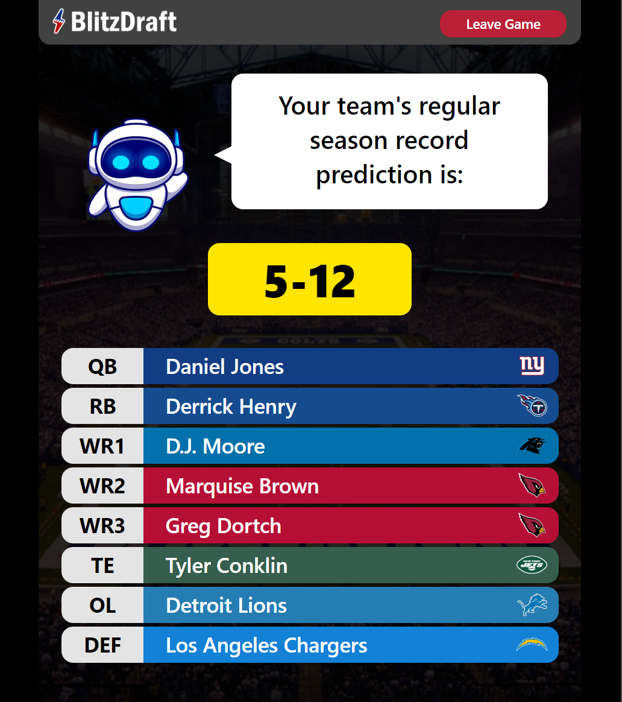

# BlitzDraft

<i>Created: Summer 2023 (Incoming College Sophomore)</i>

  
  

  
  

  
  

<b>BlitzDraft is a multiplayer mobile web game where users pick one NFL player at time from random teams to assemble the best team possible.</b>

It grades the strength of each team using a machine learning model trained from over 50,000 NFL statistics, scraped from Pro-Football-Reference.

The model is trained by comparing a team's player stats and their win total. This allows it to understand what statistics contribute most to wins and enables great record projections for fantasy rosters.

 
<b>The main game features include:</b>
 - Singleplayer mode
 - Multiplayer mode (up to 4 players)
 - Saved teams storage
 - Draft statistics
 - Google authenticated login
 - Snappy, a dynamic animated game assistant
 
<b>Tools used:</b>
 - TypeScript - Vue
 - Python - Flask
 - HTML/CSS - Tailwind, Sass
 - MongoDB, Firebase
 - Pandas, Scikit, BeautifulSoup
 - Socket.io, Chart.js
