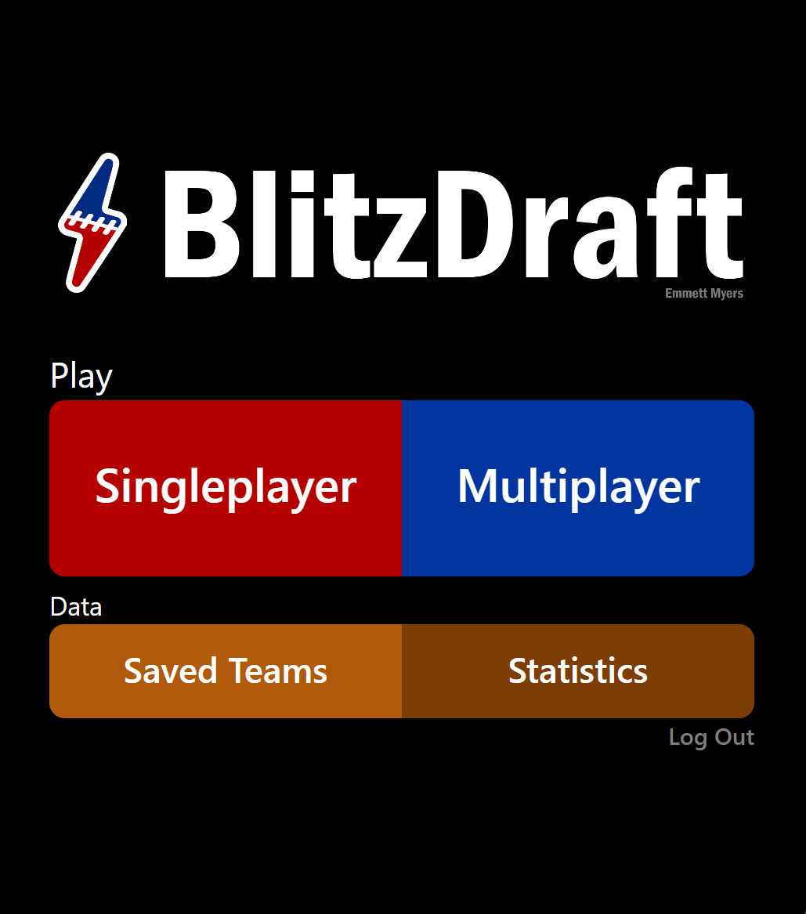

# BlitzDraft

[Live Demo](https://drive.google.com/file/d/1X9OeuzdiSbPODgQcTKTXXR1pL1DuHjRb/view)&nbsp;&nbsp;|&nbsp;&nbsp;<i>Created: Summer 2023 (Incoming College Sophomore)</i>

  
  

  
  

  
  

 
<b>BlitzDraft is a multiplayer mobile web game where users pick one NFL player at time from random teams to assemble the best team possible.</b>

It grades the strength of each team using a machine learning model trained from over 50,000 NFL statistics, scraped from Pro-Football-Reference.

The model is trained by comparing a team's player stats and their win total. This allows it to understand what statistics contribute most to wins and enables great record projections for fantasy rosters.

<b>The main game features include:</b>
<ul>
  <li>Singleplayer mode</li>
  <li>Multiplayer mode (up to 4 players)</li>
  <li>Saved teams storage</li>
  <li>Draft statistics</li>
  <li>Google authenticated login</li>
  <li>Snappy, a dynamic animated game assistant</li>
</ul>
<b>Tools used:</b>
<ul>
  <li>TypeScript - Vue</li>
  <li>Python - Flask</li>
  <li>HTML/CSS - Tailwind, Sass</li>
  <li>MongoDB, Firebase</li>
  <li>Pandas, Scikit, BeautifulSoup</li>
  <li>Socket.io, Chart.js</li>
</ul>
